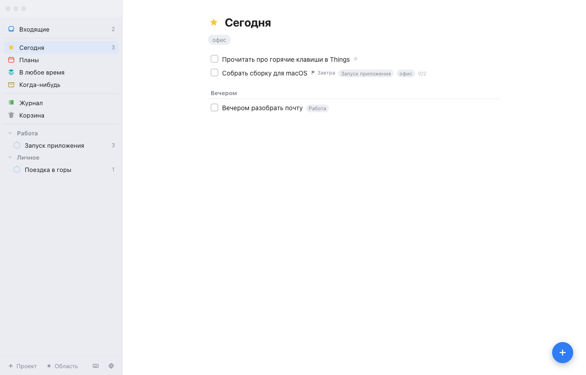
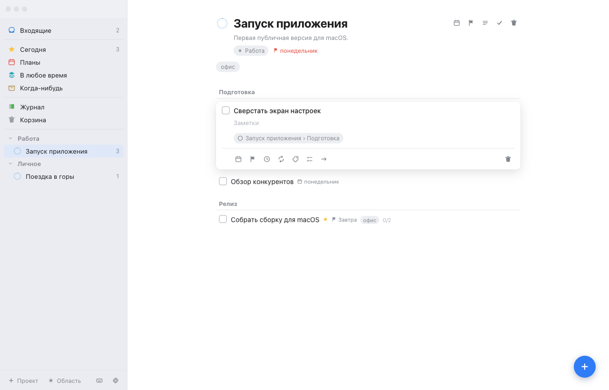

# Doings

Менеджер задач для macOS и Windows, сделанный по образу [Things 3](https://culturedcode.com/things/): области и проекты, умные списки, полностью клавиатурная работа. React + TypeScript в Electron, данные лежат локально в одном JSON-файле.



## Возможности

**Структура.** Области → проекты → заголовки внутри проекта → задачи. У задачи есть заметки, чеклист, теги, дата начала, срок сдачи, напоминание и правило повтора.

**Умные списки.** Входящие, Сегодня (с отдельной вечерней секцией), Планы, В любое время, Когда-нибудь, Журнал, Корзина. Логика повторяет оригинал в неочевидных местах: задачи отложенного проекта исчезают из «В любое время» и всплывают в «Когда-нибудь», просроченная дата поднимает задачу в «Сегодня», задача с одним лишь будущим сроком сдачи всё равно попадает на таймлайн «Планов».

**Работа руками.** Мультивыделение (⌘-клик, ⇧-клик, ⇧-стрелки) с пакетными действиями одним шагом истории. Перетаскивание задач для ручной сортировки, между секциями и на элементы сайдбара. Перетаскивание проектов и областей. Контекстное меню по правому клику на задачах, проектах, областях, списках, заголовках и тегах.

**Поиск и фильтры.** Быстрый поиск по спискам, проектам, областям, тегам и задачам (⌘F). Клик по тегу в строке открывает всё с этим тегом. Панель тегов под заголовком сужает текущий список.

**Повторы и напоминания.** Выполненная повторяющаяся задача уходит в Журнал, а её копия появляется на следующей подходящей дате со сброшенным чеклистом и сдвинутым сроком. Напоминания стреляют системным уведомлением.

**Отмена.** Любое изменение данных откатывается через ⌘Z, история на 60 шагов.

**Десктоп.** Нативное меню, быстрый ввод по глобальному хоткею ⌃⌥Space из любого приложения, светлая и тёмная темы со следованием за системой, экспорт и импорт базы.



## Горячие клавиши

| Действие                    | Клавиши               |
| --------------------------- | --------------------- |
| Новая задача / новый проект | `⌘N` / `⇧⌘N`          |
| Быстрый поиск               | `⌘F`                  |
| Списки 1–7                  | `⌘1`…`⌘7`             |
| Открыть задачу              | `⏎` или `Space`       |
| Выделение вверх-вниз        | `↑ ↓`, `⇧↑ ⇧↓`        |
| Выбрать всё в списке        | `⌘A`                  |
| Сегодня / вечером           | `⌘T` / `⌘E`           |
| Когда-нибудь / убрать дату  | `⌘O` / `⌘R`           |
| Выбрать дату                | `⌘S`                  |
| Срок сдачи / теги / повтор  | `⇧⌘D` / `⇧⌘T` / `⇧⌘R` |
| Напоминание                 | `⌥⌘R`                 |
| Переместить / дублировать   | `⇧⌘M` / `⌘D`          |
| Выполнено / отменено        | `⌘.` / `⌥⌘.`          |
| В корзину                   | `⌘⌫`                  |
| Отменить / повторить        | `⌘Z` / `⇧⌘Z`          |
| Быстрый ввод (глобально)    | `⌃⌥Space`             |
| Настройки / справка         | `⌘,` / `⌘/`           |

## Запуск

Нужен Node.js 22 или новее.

```bash
npm install
npm run dev        # веб-версия на http://localhost:5273
npm run desktop    # окно Electron поверх dev-сервера (dev должен быть запущен)
```

Сборка установщиков:

```bash
npm run package:mac   # .dmg в release/
npm run package:win   # .exe (NSIS) в release/
```

Обе команды сначала прогоняют `npm run verify`, так что со сломанными типами, линтом или тестами релиз не соберётся. Установщики не подписаны: macOS при первом запуске покажет предупреждение (открыть через контекстное меню → «Открыть»), Windows — SmartScreen.

## Где лежат данные

В приложении — один JSON-файл в папке пользовательских данных:

```
~/Library/Application Support/doings/database.json
```

Запись атомарная: сначала временный файл, потом переименование, предыдущая версия остаётся рядом как `database.json.bak`. В браузерной версии данные хранятся в `localStorage`. Копию можно сохранить и загрузить из настроек (`⌘,`).

Файл проходит проверку при каждом чтении: неизвестные значения приводятся к разумным, невозможные даты и время (`2026-02-30`, `47:80`) отбрасываются, битые ссылки очищаются, записи без идентификатора выбрасываются — одна испорченная строка не стоит всей базы. Всё, что было исправлено, показывается баннером. Схема версионируется, конвертация старых файлов живёт в `src/domain/validate.ts`. Базы, созданные до переименования приложения (папка `things-clone`), переносятся автоматически при первом запуске.

Что происходит, когда файл прочитать нельзя:

- **сломанный JSON** — берётся резервная копия `database.json.bak`; если и она испорчена, файл откладывается как `database.json.corrupt-<дата>.json`, приложение открывается с демо-данными, а путь к отложенному файлу показывается в баннере;
- **схема новее, чем понимает приложение** — файл не открывается и не перезаписывается, запись блокируется целиком, чтобы не потерять поля, о которых эта версия не знает;
- **недоступное хранилище или ошибка записи** — работа продолжается в памяти, но с явным предупреждением.

## Стек и структура

Vite, React 19, TypeScript, zustand с immer и персистентностью, date-fns, Electron, electron-builder.

```
src/domain/      предметная логика: типы, даты, умные списки, правила повтора
src/store/       стор, персистентность, экспорт-импорт, демо-данные
src/components/  интерфейс
src/hooks/       клавиатура, меню приложения, напоминания
src/styles/      токены оформления и стили
electron/        главный процесс и preload
build/           иконки и их исходник
scripts/         генерация иконок из PNG
```

Умные списки и повторы — чистые функции без React и стора, поэтому покрыты тестами напрямую.

## Проверки

```bash
npm run verify   # типы + линтер + формат + тесты
npm test         # только тесты
npm run lint     # oxlint
npm run format   # prettier
```

68 тестов: разбор умных списков во всех вариантах, правила повтора, пакетные операции стора, отмена, импорт базы, порядок при перетаскивании. CI на GitHub Actions прогоняет проверки на каждый пуш, установщики собирает на теге `v*`.

## Чего пока нет

Синхронизации между устройствами, интеграции с Календарём и Напоминаниями macOS, вложенных тегов, повторяющихся проектов, автообновления и подписи кода.

## Лицензия

[MIT](LICENSE).

Проект учебный и не связан с Cultured Code. Things — товарный знак Cultured Code GmbH & Co. KG; здесь воспроизведены только идеи организации задач, без кода и ресурсов оригинала.
